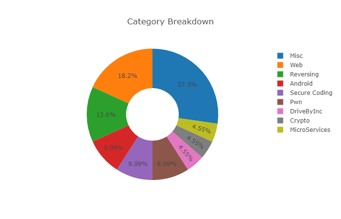
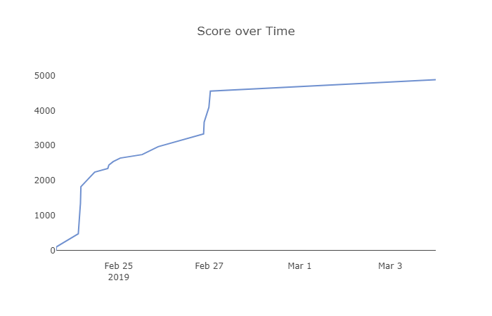

# TAMUctf

## Description
https://tamuctf.com/challenges

CTF put on by Texas A&M University Students!
The competition will run from February 22nd at 6:00 pm CST to March 3rd at 6:00 pm CST

## Solves

| Problem | Category | Points |
|:- |:- | -:|
[Pwn1](pwn/pwn1/) | Pwn | 384
[Pwn4](pwn/pwn4/) | Pwn | 446
[Secrets](android/secrets/) | Android | 482
[Local News](android/local_news/) | Android | 495
[Cheesy](reversing/cheesy/) | Reversing | 307
[Snakes over cheese](reversing/snakes_over_cheese/) | Reversing | 376
[042](reversing/042/) | Reversing | 484
[-.-](crypto/-.-/) | Crypto | 391
[Not Another SQLi Challenge](web/not_another_sqli_challenge/) | Web | 307
[Robots Rule](web/robots_rule/) | Web | 426
[Buckets](web/buckets/) | Web | 435
[Science!](web/science/) | Web | 327
[Howdy!](misc/howdy/) | Misc | 1
[Who am I?](misc/who_am_i/) | Misc | 144
[Who do I trust?](misc/who_do_i_trust/) | Misc | 216
[Where am I?](misc/where_am_i/) | Misc | 159
[Hello World](misc/hello_world/) | Misc | 427
[Onboarding Checklist](misc/onboarding_checklist/) | Misc | 468
[SQL](secure_coding/sql/) | Secure Coding | 419
[PWN](secure_coding/pwn/) | Secure Coding | 423
0_intrusion | MicroServices | 100
[0_intrusion](drive_by_inc/0_intrusion/) | DriveByInc | 100

| Category | Problems | Solved |
|:- | -:| -:|
Pwn | 7 | 2
Network/Pentest | 8 | 0
Android | 3 | 2
Reversing | 8 | 3
Crypto | 5 | 1
Web | 8 | 4
Misc | 7 | 6
Secure Coding | 3 | 2
MicroServices | 2 | 1
ReadingRainbow | 4 | 0
DriveByInc | 2 | 1
Honeypot | 5 | 0

## Scoreboard

360th out of 1895

| Position | Team | Points |
| - | - | -:|
360 | biylda | 4882

