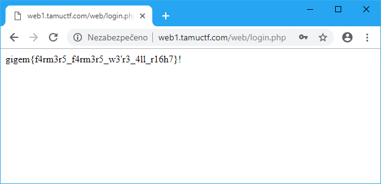

# Not Another SQLi Challenge

## Points
307

## Description
http://web1.tamuctf.com

Difficulty: easy

## Solution
As the name suggests, this will be an [SQL injection](https://en.wikipedia.org/wiki/SQL_injection) challenge.

Enter `' or '1'='1` in both fields.

Voilà! Access granted.

## Flag
`gigem{f4rm3r5_f4rm3r5_w3'r3_4ll_r16h7}`