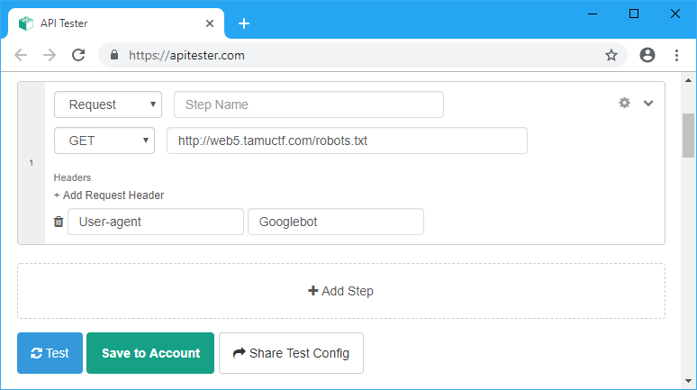

# Robots Rule

## Points
426

## Description
http://web5.tamuctf.com

Difficulty: easy

## Solution
As the name suggests, this will be about [robots](https://en.wikipedia.org/wiki/Robots_exclusion_standard).

http://web5.tamuctf.com/robots.txt
```
User-agent: *

WHAT IS UP, MY FELLOW HUMAN!
HAVE YOU RECEIVED SECRET INFORMATION ON THE DASTARDLY GOOGLE ROBOTS?!
YOU CAN TELL ME, A FELLOW NOT-A-ROBOT!
```

Let's change the `User-agent` request header to [whatever google robot uses](https://support.google.com/webmasters/answer/6062596).

We can use https://apitester.com/.


Request Headers
```
GET /robots.txt HTTP/1.1
Host: web5.tamuctf.com
Accept: */*
User-Agent: Googlebot
```
Response Body
```
User-agent: *

THE HUMANS SUSPECT NOTHING!
HERE IS THE SECRET INFORMATION: gigem{be3p-bOop_rob0tz_4-lyfe}
LONG LIVE THE GOOGLEBOTS!
```

Or we can use `curl` command.
```sh
λ curl --header "User-agent: Googlebot" http://web5.tamuctf.com/robots.txt
User-agent: *

THE HUMANS SUSPECT NOTHING!
HERE IS THE SECRET INFORMATION: gigem{be3p-bOop_rob0tz_4-lyfe}
LONG LIVE THE GOOGLEBOTS!
```

## Flag
`gigem{be3p-bOop_rob0tz_4-lyfe}`